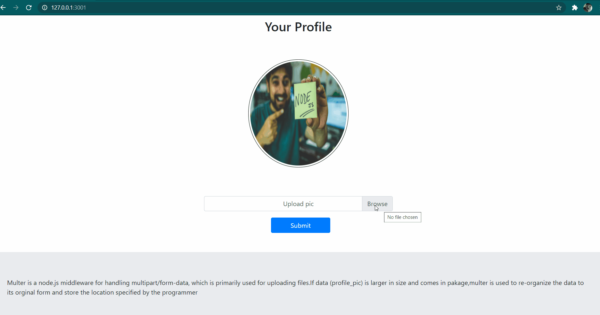

# Multer-upload-your-profile-picture
Multer is a node.js middleware for handling multipart/form-data, which is primarily used for uploading files.If data(profile_pic) is larger in size and comes in pakage,multer is used to re-organize the data to its orginal form and store the location specified by the programmer.
## preview


## Assets
- express.js
- multor npm 
- _ejs_ template engine
- bootstrap 4

## To Run
do git clone of the repository https://github.com/mayur-keswani/Multer-upload_your_profile_picture.git.
In the project directory, you can run: 
#### `npm install`
#### `nodemon` / `node server.js`
After running above commands , your website will be live:
Open [http://localhost:3001](http://localhost:3001) to view it in the browser.

## How you can contribute to this repository 🤝:
 1) Star this repository
 2) Fork this repository
 3) Commit changes with a meaningful commit message like "Added Expanation to line number 1 in server.js".
 4) Create a pull request.
Sit back and relax while your pull request is reviewed and merged.


_Glad to see you here! Show some love by starring this repo._
```Javascript
 if (isAwesome) {
    // thanks in advance 
    starThisRepository();📲
  }
```